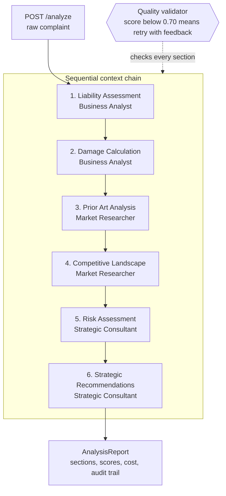

# Legal Intelligence AI System

A multi-agent legal analysis system built on Google Vertex AI (Gemini). It takes a raw legal complaint and produces a structured strategic analysis: liability, damages, prior art, competitive landscape, risk and recommendations. Three specialist personas work in sequence, each building on the previous sections, while a quality validator scores every section and forces a retry when the output falls below 0.70.

Built as the project for the Udacity course on agentic reasoning with Vertex AI. The scenario: LexiMind Solutions, a LegalTech startup, has working infrastructure but agents that don't know who they are, how to reason or how to pass context. The client case is TechFlow Innovations v. DataSync Corp, a patent infringement dispute.

## How it works



Each section goes through the same loop:

1. The agent receives its persona, chain-of-thought instructions, the case details and all previously completed sections.
2. Gemini generates the section. Transient API failures retry with exponential backoff (1 s, 2 s).
3. The validator scores coherence, groundedness, completeness and structure.
4. Below 0.70, the agent retries with the validator's feedback appended to its prompt, up to 2 times. The highest-scoring version is kept.
5. The section joins the context for the next agent.

## Project structure

```
.
├── main.py                        # FastAPI application and endpoints
├── export_report.py               # Converts an /analyze response into final_report.md
├── test_setup.py                  # Checks .env, key file and Google Cloud auth
├── test_scenarios.json            # Sample cases (TechFlow, MediTech)
├── requirements.txt
├── src/
│   ├── core/
│   │   ├── agent_system.py        # TODOs 1-3: Vertex AI, generation, orchestration
│   │   └── quality_validator.py   # TODOs 4-5: coherence and groundedness scoring
│   ├── prompts/
│   │   └── personas.py            # TODOs 6-8: expert personas
│   ├── models/
│   │   └── legal_models.py        # Pydantic data models
│   └── utils/
│       └── logger.py              # Structured logging
└── tests/
    ├── test_todos.py              # Provided test suite for all 8 TODOs
    └── test_quality_ranking.py    # High vs medium vs low quality ranking
```

## What was implemented

| TODO | File | Implementation |
|---|---|---|
| 1 | `agent_system.py` | Vertex AI client via `google-genai`, model wrapper, smoke test prompt, error handling that returns `False` instead of crashing |
| 2 | `agent_system.py` | Section generation with 3 attempts and exponential backoff, fail-fast on 400/401/403/404, token tracking including thinking tokens, cost estimate |
| 3 | `agent_system.py` | Six-section orchestration, full context chain, quality retry loop with feedback, graceful degradation, audit trail in report metadata |
| 4 | `quality_validator.py` | Coherence score from paragraph structure (0.3), logical connectors (0.2), structure markers and lists (0.2), sentence depth (0.3) |
| 5 | `quality_validator.py` | Groundedness score from section-specific vocabulary (0.4), reasoning indicators and concrete figures (0.3), expected element coverage (0.3) |
| 6 | `personas.py` | `BUSINESS_ANALYST_PERSONA`: liability and damages, TAM/SAM/SOM, Georgia-Pacific factors, Panduit test, Halo v. Pulse |
| 7 | `personas.py` | `MARKET_RESEARCHER_PERSONA`: prior art and competition, patent citation analysis, technology S-curves, KSR v. Teleflex, Porter's Five Forces |
| 8 | `personas.py` | `STRATEGIC_CONSULTANT_PERSONA`: risk and strategy, decision trees, game theory, risk matrices, SWOT, NPV/ROI, eBay and Winter injunction tests |

## Design decisions

**SDK compatibility layer.** The project runs on `google-genai`, which replaced the deprecated `vertexai.generative_models` module. The provided TODO 1 test still patches `vertexai` and `GenerativeModel` from the old SDK. `agent_system.py` exposes both names as thin wrappers around `genai.Client`, so the tests and the real runtime share one code path.

**Six sections instead of four.** The rubric mentions a four-section report. The TODO 3 specification and `test_todos.py` define six sections, so the system generates six. That covers the four-section requirement and gives each persona two sections.

**Full context chain.** The original prompt builder passed only the last two sections, truncated to 500 characters. Now every completed section is passed on: the two most recent with 1,200 characters, older ones with 600. The Strategic Consultant sees liability and damages findings, not only risk.

**Bounded quality loop.** Two quality retries per section at most, keeping the best-scoring version. This caps the worst case at 18 model calls per report and prevents endless loops on sections that can't reach the threshold.

**Graceful degradation.** A section that fails after all retries becomes a flagged placeholder with a score of 0.0 and the report continues. Failed sections are excluded from the context chain. Authentication, permission and model-not-found errors stop the run immediately, since every section would fail the same way.

**Cost accuracy.** The starter used 2024 rates. `MODEL_PRICING_PER_1M` now holds Vertex AI rates for Gemini 2.5 Flash ($0.30 input, $2.50 output per 1M tokens) and 2.5 Flash-Lite. Thinking tokens count as output tokens because they're billed that way.

**Output token limit.** Gemini 2.5 counts thinking tokens against `max_output_tokens`. The original 2,048 truncated sections or returned empty text, so the limit is now 8,192.

**Bias-aware personas.** Every persona treats complaint allegations as claims rather than established facts, weighs the opposing side's strongest arguments and must not invent case citations, patent numbers or financial data.

Persona names in the implementation guide map to the code as follows: IP Valuation Specialist is `BUSINESS_ANALYST_PERSONA`, Patent Researcher is `MARKET_RESEARCHER_PERSONA` and IP Litigation Expert is `STRATEGIC_CONSULTANT_PERSONA`.

## Setup

### Prerequisites

- Python 3.10 or newer (tested with 3.13)
- A Google Cloud project with the Agent Platform (Vertex AI) API enabled
- A service account with the **Vertex AI User** role and a downloaded JSON key

### Google Cloud

1. In the console, open **APIs & Services**, search for Agent Platform API and enable it.
2. Open **IAM & Admin > Service Accounts**, create or select a service account and grant it **Vertex AI User** (`roles/aiplatform.user`).
3. Open the service account, go to **Keys > Add key > Create new key > JSON** and download the file. It can't be downloaded again.

### Local environment

```bash
git clone https://github.com/n1n4xyz/legal-intelligence.git
cd legal-intelligence

# Put the downloaded key into the project root
mv ~/Downloads/<your-key-file>.json ./service-account-key.json

# Create .env with an absolute path to the key
cat > .env <<EOF
PROJECT_ID=your-gcp-project-id
LOCATION=us-central1
MODEL=gemini-2.5-flash
GOOGLE_APPLICATION_CREDENTIALS=$(pwd)/service-account-key.json
DEBUG=false
LOG_LEVEL=INFO
PORT=8000
EOF

python3 -m venv .venv
source .venv/bin/activate        # Windows: .venv\Scripts\activate
pip install -r requirements.txt

python test_setup.py
```

`main.py` and `test_setup.py` load `.env` themselves. Don't `source` it into your shell (see Troubleshooting).

## Testing

```bash
python tests/test_todos.py 2>&1 | tee test_output.txt
python tests/test_quality_ranking.py
```

`test_todos.py` runs 21 tests across all 8 TODOs. No test calls the real API.

`test_quality_ranking.py` checks that the validator ranks analysis correctly. Current scores:

| Sample | Coherence | Groundedness | Overall |
|---|---|---|---|
| High quality | 1.00 | 0.93 | 0.93 |
| Medium quality | 0.32 | 0.21 | 0.26 |
| Low quality | 0.10 | 0.00 | 0.05 |

The TODO 3 test in `test_todos.py` is declared `async def` inside a standard `unittest.TestCase`, so unittest never awaits it and it passes without executing. The orchestration was verified separately with mocked generation: six sections in order, each receiving all previous sections, with retries triggered below 0.70.

## Running the system

Start the server:

```bash
python main.py
```

In a second terminal, build a request from the TechFlow scenario, run the analysis and export the report:

```bash
python3 -c "import json;s=json.load(open('test_scenarios.json'))['scenarios'][0];json.dump({'case_name':s['case_name'],'complaint_text':s['complaint_text'],'case_type':s['case_type'],'urgency':s['urgency_level'],'additional_context':s['additional_context']},open('techflow_request.json','w'))"

curl -s -X POST localhost:8000/analyze \
  -H "Content-Type: application/json" \
  -d @techflow_request.json | python3 -m json.tool | tee report.json

python export_report.py report.json test_output.txt
```

One analysis takes 1-3 minutes and makes 6 to 18 model calls. The result is written to `final_report.md`.

### API endpoints

| Method | Path | Purpose |
|---|---|---|
| GET | `/` | Service info |
| GET | `/health` | Health check, 503 if not initialized |
| GET | `/status` | Configuration and analysis count |
| POST | `/analyze` | Run the full multi-agent analysis |
| POST | `/validate` | Score an existing report |
| GET | `/agents` | Personas with capabilities and focus areas |
| GET | `/metrics` | Token usage, average processing time, success rate |
| POST | `/reset` | Re-initialize the system |
| GET | `/docs` | Interactive OpenAPI documentation |

## Operational transparency

Every report includes `total_cost`, `total_tokens`, `processing_time` and `confidence_score` (mean section quality). The `metadata` field adds:

- `quality_audit`: every attempt score per section, the kept score, tokens and cost
- `quality_retries_used` and `sections_below_threshold`
- `failed_sections` with error messages
- `section_sequence`, `model` and `success_rate`

`/metrics` aggregates token usage and success rate across all runs since startup.

## Results

The generated TechFlow analysis with run summary, quality audit and test output is in [`final_report.md`](final_report.md).

## Troubleshooting

| Problem | Fix |
|---|---|
| `404` or model not found | Gemini 2.0 Flash was shut down in June 2026. Set `MODEL=gemini-2.5-flash` in `.env` |
| `PROJECT_ID not set` | `.env` has to sit in the project root next to `main.py` |
| `Your default credentials were not found` in `main.py` | Check that `GOOGLE_APPLICATION_CREDENTIALS` is an absolute path and the file exists |
| Same message during `test_todos.py` | Expected. `test_initialization_failure_handling` checks failure handling without credentials |
| `test_initialization_failure_handling` fails | Your shell has the `.env` variables exported, so a real connection succeeds. Open a fresh terminal |
| `403 Permission denied` | The service account needs Vertex AI User. The Agent Platform API must be enabled. Wait 2-3 minutes after enabling |
| `422 Unprocessable Entity` on `/analyze` | The request needs `case_name`, `complaint_text` and `case_type`. Use the request builder above |
| Quality scores below 0.70 | Check `quality_audit` in the report to see which section and which attempts failed |
| `Quota exceeded` | Check the Quotas page in the Google Cloud Console |

## Security

`.env`, service account keys, virtual environments and `.DS_Store` files are excluded in `.gitignore`. Never commit a key. If one leaks, delete it under **IAM & Admin > Service Accounts > Keys** and create a new one.

## Limitations

- The quality validator uses keyword and structure heuristics. It measures form and vocabulary, not legal correctness. An LLM-as-judge evaluation would be the next step.
- Pricing is hardcoded per model and needs updating when Google changes rates or when you switch models.
- Case citations in the output come from the model and are not verified against a legal database.
- The output is a strategic analysis for practice purposes and not legal advice.

## Credits

Starter infrastructure (FastAPI server, data models, logging, tests) provided by Udacity. Implementation of TODOs 1-8, the quality ranking test, report export and design changes by [Nina Haide](https://github.com/n1n4xyz).